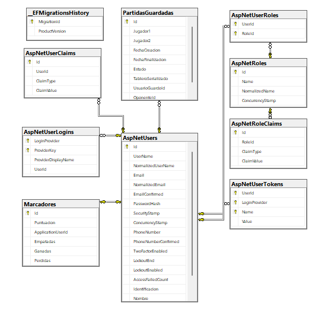

# Proyecto Connect4

## Integrantes
- **Luis Emmanuel Cervantes Rubí** – Carné: FH22013088  
- **Marco David González Chaves** – Carné: FH22012212
- **Diego José Ramírez Corrales** – Carné: FH22012601 

## Información de Git
- **Cerem0208**: emacervantes21@gmail.com  
- **MarcoDGCH19**: marcochaves0919@gmail.com  
- **RouryR**: Rouryffx@hotmail.com

## Frameworks y herramientas utilizadas
- Visual Studio 2022 (VS)
- Blazor
- SQL Server
- Identity
- JavaScript
- CSS
- HTML
- BootStrap
- DbFactory
- AuthUserStateService
- Swagger

## Tipo de aplicación
- **MPA** (Multi-Page Application)

## Arquitectura utilizada
- **MVC** (Modelo - Vista - Controlador)

## Diagrama de la base de datos


## Intructivo de Instalación 

1. Clonar el proyecto del repositorio
2. Verificar que tiene instalado al menos el sdk 9.0.301 de dotnet 
3. Tener instalado sql server
4. Tener instalado visual studio 2022
4. En el ConnectionStrings de appsettings.json se debe de cambiar el user de la base de datos al de su sql server  
5. Si no existe crear una migracion con el comando "Add-Migration Inicial"
6. Actualizar la base de datos con el comando "Update-Database" 

## Link repositorios 
1. https://learn.microsoft.com/es-es/training/modules/dotnet-connect-four/
2. https://dotnet.microsoft.com/es-es/apps/aspnet/web-apps/blazor
3. https://learn.microsoft.com/en-us/aspnet/core/blazor/security/authentication-state?view=aspnetcore-9.0&pivots=server
4. https://docs.oracle.com/middleware/1221/jdev/api-reference-esdk/oracle/javatools/db/DatabaseFactory.html
5. https://experienceleague.adobe.com/es/docs/contributor/contributor-guide/writing-essentials/markdown

## Uso de IA

### Preguntas

1. Tengo una aplicación con C# y Entity Framework Core. Necesito una función para guardar el estado de una partida de un juego de conecta 4 con campos como nombre del jugador, nombre del oponente, id del oponente, fecha de creación, estado de la partida, el tablero serializado en JSON y el ID del usuario que guardó la partida.

2. Tengo una aplicación en C#. Quiero verificar el empate de un tablero que sería una matriz bidimensional que cuando se llena y no hay ganador exista el empate.

3. Tengo una aplicación en C#. Tengo una función que recibe un DateTime. Quiero que devuelva una cadena con la fecha formateada donde me diga el día de la semana, día numérico, mes y el año.

4. Necesito un efecto visual para marcar las celdas ganadoras de Conecta 4 en Blazor. Quiero que brillen de forma alternada y tengan un leve efecto de agrandarse y encogerse.

5. Tengo un tablero de Conecta 4 en Blazor. Guardo la fila destino en una variable `FilaAnimacion` y la columna en `ColumnaAnimacion`. Quiero una animación CSS que mueva una ‘chip’ hasta esa casilla.

6. ¿Cómo puedo agregar columnas nuevas a Identity? Debo agregar Identificacion, Nombre, FotoBase64, Marcador en una clase que se llame `ApplicationUser`.

---

### Respuestas

**1. Guardar partida pendiente**
```csharp
private async Task GuardarPartidaPendiente()
{
    using var db = DbFactory.CreateDbContext();

    var partidaPendiente = new PartidaGuardada
    {
        Jugador1 = UsuarioActual.Nombre,
        Jugador2 = OponenteSeleccionado.Nombre,
        OponenteId = OponenteSeleccionado.Id,
        FechaCreacion = DateTime.Now,
        Estado = EstadoPartida.Pendiente,
        TableroSerializado = JsonConvert.SerializeObject(Tablero),
        UsuarioGuardoId = UsuarioActual.Id
    };

    db.PartidasGuardadas.Add(partidaPendiente);
    await db.SaveChangesAsync();
}
```

**2. Verificar empate en el tablero**
```csharp
bool tableroLleno = true;
for (int c2 = 0; c2 < Columnas; c2++)
{
    if (Tablero[c2, 0] == 0)
    {
        tableroLleno = false;
        break;
    }
}
```

**3. Formatear fecha completa**
```csharp
private string FormatearFechaCompleta(DateTime fecha)
{
    var cultura = new CultureInfo("es-ES");
    string diaSemana = cultura.DateTimeFormat.GetDayName(fecha.DayOfWeek);
    string mes = cultura.DateTimeFormat.GetMonthName(fecha.Month);

    diaSemana = char.ToUpper(diaSemana[0]) + diaSemana[1..];
    mes = char.ToLower(mes[0]) + mes[1..];

    return $"{diaSemana} {fecha.Day} {mes} {fecha.Year} {fecha:hh:mm tt}";
}
```

**4. Efecto visual para celdas ganadoras**
```css
.ganadora {
    animation: brillar 0.8s infinite alternate;
}

@keyframes brillar {
    0% {
        box-shadow: 0 0 20px 10px gold, 0 0 10px 5px orange;
        transform: scale(0.5);
    }
    100% {
        box-shadow: 0 0 40px 20px orange, 0 0 20px 10px gold;
        transform: scale(1);
    }
}
```

**5. Animación CSS para chip**
```css
.animation-container {
    position: absolute;
    top: 0;
    width: 80px;
    height: 100%;
    display: flex;
    justify-content: center;
    pointer-events: none;
    z-index: 10;
}

.falling-chip {
    position: absolute;
    width: 70px;
    height: 70px;
    border-radius: 50%;
    margin: 5px;
    animation: fall 0.5s ease-in forwards;
    top: 0;
    transform: translateY(0);
}

@keyframes fall {
    to {
        transform: translateY( @(FilaAnimacion * 80 + 5)px);
    }
}
```

**6. Agregar columnas nuevas a Identity**
```csharp
public class ApplicationUser : IdentityUser
{
    public int Identificacion { get; set; }
    public string Nombre { get; set; } = string.Empty;
    public string? FotoBase64 { get; set; }
    public Marcador? Marcador { get; set; }
}
```